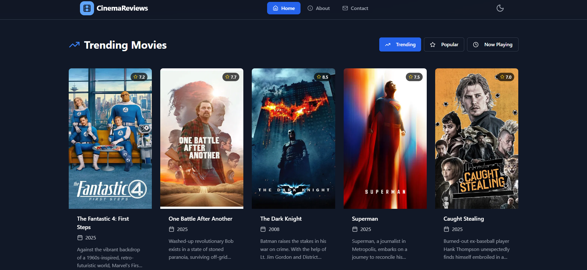
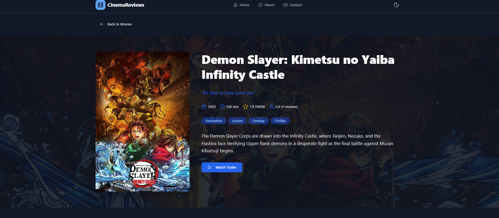
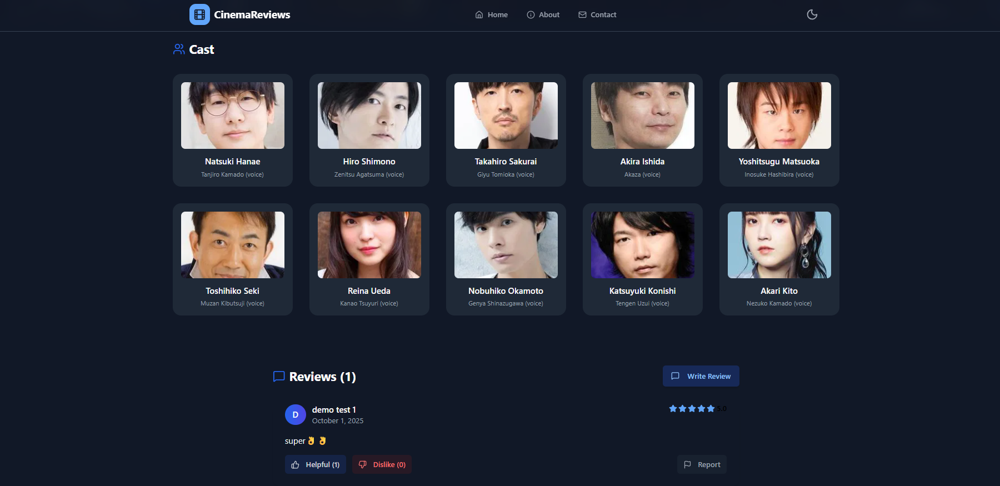
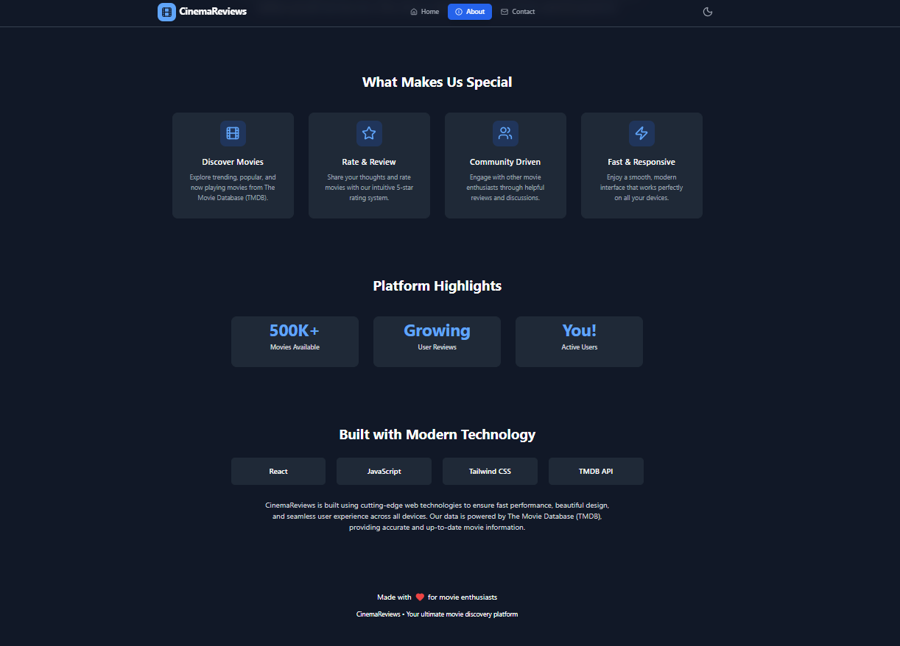
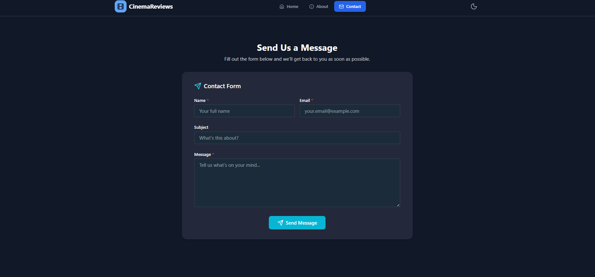

# 🎬 Movie Review & Rating Platform

Movie Review & Rating Platform is an **interactive, responsive React-based platform** designed for movie enthusiasts.  
Users can **browse movies, write reviews, rate films, and interact with community feedback**—helping everyone discover great movies.  

---

## 🔥 Features

### ✅ User Reviews & Ratings
- Submit reviews for any movie  
- Rate movies using a **star system**  
- View **helpful/dislike counts** on each review  
- Report inappropriate reviews  
- Each review tracks **helpful, disliked, and reported actions**  

### 🎬 Browse & Discover
- Search and filter movies by **title, genre, or trending**  
- Detailed movie pages with **ratings, reviews, trailers, and descriptions**  
- **Responsive layout** powered by Tailwind CSS  

### 🧩 Interactive Review System
- Mark reviews as **helpful/dislike** (visible to all users)  
- Report spam or inappropriate reviews with one click  
- Persistent actions via **localStorage (demo) / backend (production-ready)**  
- Edit or delete your own reviews  

---

## 🧪 Technologies Used
- ⚛️ **React + Vite**  
- 🧵 **Tailwind CSS**  
- 🗂️ **localStorage / REST API** (depending on deployment)  
- 📦 **Custom Review Service Logic**  
- 🧪 **Custom Hooks & Compound Components** for rating and review UX  
- 🎬 **The Movie Database (TMDB) API** (for movie metadata)  

---

## 📘 Learnings
- Built an **interactive review system** with persistent user actions  
- Developed a **responsive movie browser** using React + Tailwind CSS  
- Used **custom hooks** for localStorage state and API logic  
- Designed scalable **card and rating UI** for great UX  
- Implemented a **community-driven feedback system** fully visible to all visitors  

---

## 📸 Screenshots

🏠 **Home / Browse Page**  


🎬 **Movie Detail Page**  


⭐ **Cast & Review Interaction**  


💬 **About Page**  


📱 **Contact Page**  


---

## 💻 Installation

### 1. Clone the repository:

```bash
git clone https://github.com/kadi-uday/Movie_Review-Rating_Platform.git
cd Movie_Review-Rating_Platform
```

### 2. Install dependencies:

```bash
npm install
```

### 3. Create a .env file:
```bash
env

VITE_CONTACT_FORM_KEY=your_key
VITE_TMVITE_TMDB_API_KEYDB_KEY=your_key
```

### 4. Run the development server:

```bash
npm run start
```

---

## Important Note

To use this application, you need to have your own TMDB (The Movie Database) API key and Contact form key (Web3 Forms). Make sure to set these keys in your environment variables or configuration files before running the app locally or deploying it.

---

## Live Demo

Check out the live demo of this project here:
[Movie Review & Rating Platform](https://movie-review-rating-platfrom.netlify.app/)

---

## Contributing

Contributions are welcome! If you find any issues or have suggestions for improvements, please feel free to open an issue or submit a pull request.